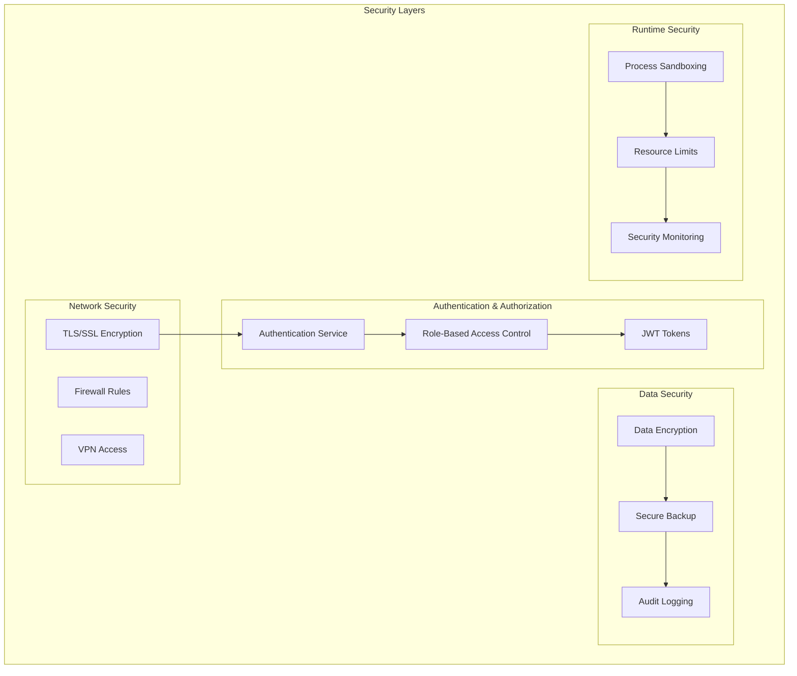

# Wattle Scheduler 技术架构图

## 系统整体架构


## 核心模块架构


## DAG 执行流程


## 数据流架构


## 存储架构


## 网络通信架构


## 部署架构


## 安全架构



## 监控架构


## 开发工作流

```mermaid
gitgraph
    commit id: "Initial"
    branch feature/dag-support
    checkout feature/dag-support
    commit id: "Add DAG types"
    commit id: "Implement validation"
    commit id: "Add topo sort"
    checkout main
    merge feature/dag-support
    commit id: "Release v0.1.0"
    
    branch feature/api-server
    checkout feature/api-server
    commit id: "Add Axum server"
    commit id: "Implement REST API"
    commit id: "Add middleware"
    checkout main
    merge feature/api-server
    commit id: "Release v0.2.0"
```
